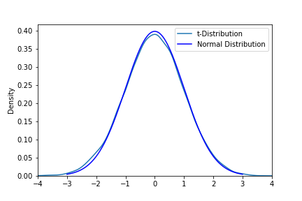

-- Note:  Readme is not complete.  Notebooks are annotated.

## Topics

1.  Central Limit Theorem
1.  Likelihood versus Probability
1.  Standard Deviation Heuristics with Normal Distribution
1.  Distribtion Comparisons (t-distribution and normal distribution)
1.  Meaning of Test Statistics, t-value and z-value
1.  Application of Distributions - t-tests and confidence intervals
1.  Evaluation of Errors, $\alpha, \beta$
1.  Normality Tests

## Contents

  

  

  

  

  

  

<table style="border: 1px solid black;">
    <tr style="border: 1px solid black;">
        <td></td>
        <td style="border: 1px solid black; text-align: center; font-weight:bold;" colspan="2"> Truth about Population </td>
    </tr>
    <tr style="border: 1px solid black;">
        <td style="border: 1px solid black;  text-align: center; font-weight:bold;"> Hypothesis </td>
        <td style="text-align: center"> True Effect ($H_1$) </td>
        <td style="text-align: center"> No Effect ($H_0$) </td>
    </tr>
    <tr>
        <td style="border: 1px solid black; text-align: center;"> Reject $H_o$ </td>
        <td style="text-align: center"> True </td>
        <td style="text-align: center"> Type I / Alpha Error </td>
    </tr>
    <tr>
        <td style="border: 1px solid black; text-align: center;"> Fail to Reject $H_o$ </td>
        <td style="text-align: center"> Type II / Beta Error </td>
        <td style="text-align: center"> True </td>
    </tr>
</table>  

